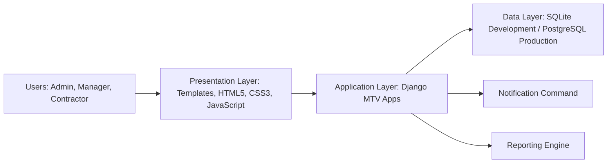
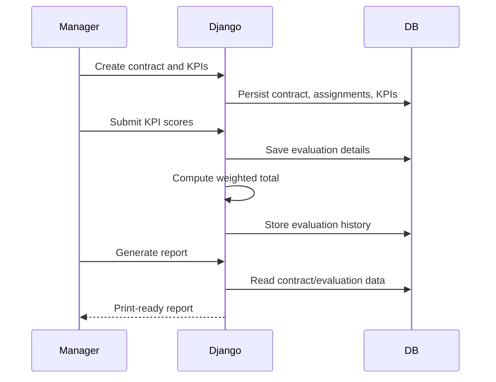

# System Design

## Three-Tier Architecture

## Data Flow

## Navigation Structure

Dashboard, Contracts, Assignments, KPIs, Evaluations, Reports, Notifications, Users.

## URL Routing Plan

`/` dashboard
`/login/`, `/logout/` authentication
`/users/` administration
`/contracts/` lifecycle management
`/assignments/` contractor and supervisor assignment
`/kpis/` KPI definition
`/evaluations/` performance evaluation
`/reports/` reporting
`/notifications/` alerts
