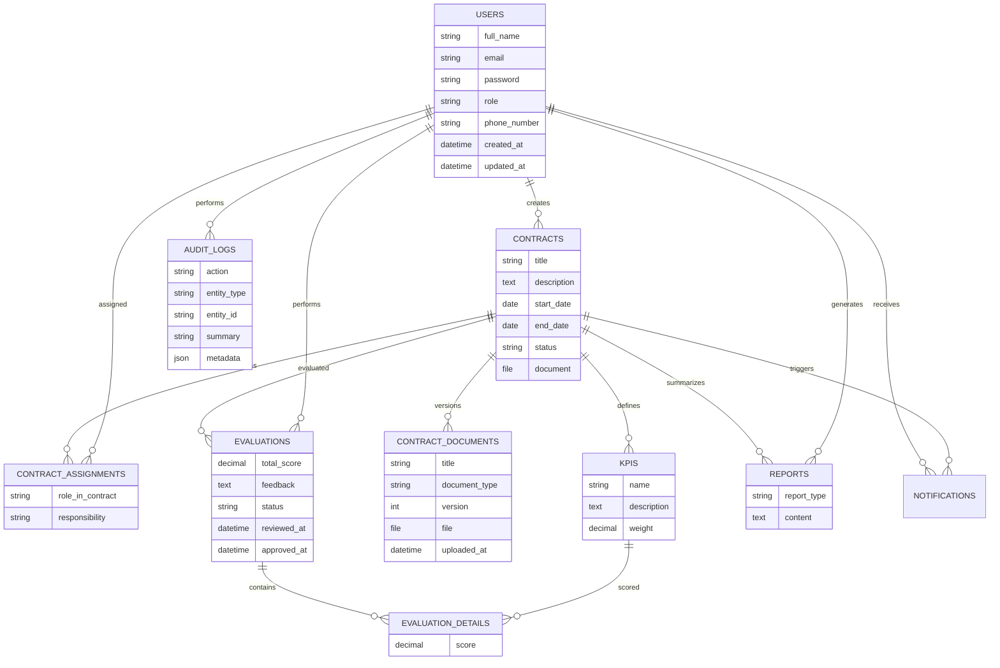

# Database Schema

```mermaid
erDiagram
  USERS ||--o{ CONTRACTS : creates
  CONTRACTS ||--o{ CONTRACT_ASSIGNMENTS : has
  USERS ||--o{ CONTRACT_ASSIGNMENTS : assigned
  CONTRACTS ||--o{ KPIS : defines
  CONTRACTS ||--o{ CONTRACT_DOCUMENTS : versions
  CONTRACTS ||--o{ EVALUATIONS : evaluated
  USERS ||--o{ EVALUATIONS : performs
  EVALUATIONS ||--o{ EVALUATION_DETAILS : contains
  KPIS ||--o{ EVALUATION_DETAILS : scored
  CONTRACTS ||--o{ REPORTS : summarizes
  USERS ||--o{ REPORTS : generates
  USERS ||--o{ NOTIFICATIONS : receives
  CONTRACTS ||--o{ NOTIFICATIONS : triggers
  USERS ||--o{ AUDIT_LOGS : performs

  USERS {
    string full_name
    string email
    string password
    string role
    string phone_number
    datetime created_at
    datetime updated_at
  }
  CONTRACTS {
    string title
    text description
    date start_date
    date end_date
    string status
    file document
  }
  CONTRACT_ASSIGNMENTS {
    string role_in_contract
    string responsibility
  }
  KPIS {
    string name
    text description
    decimal weight
  }
  EVALUATIONS {
    decimal total_score
    text feedback
    string status
    datetime reviewed_at
    datetime approved_at
  }
  EVALUATION_DETAILS {
    decimal score
  }
  REPORTS {
    string report_type
    text content
  }
  CONTRACT_DOCUMENTS {
    string title
    string document_type
    int version
    file file
    datetime uploaded_at
  }
  AUDIT_LOGS {
    string action
    string entity_type
    string entity_id
    string summary
    json metadata
  }
```
